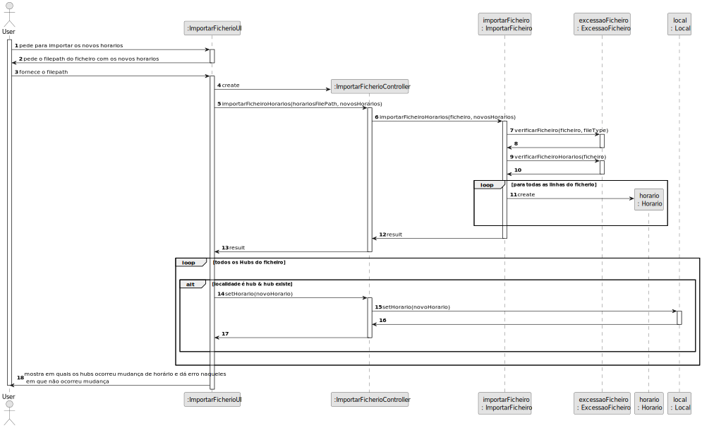

## Planeamento da US-EI11

Como Product Owner pretendo carregar um ficheiro com os horários de funcionamento de uma lista de hubs. Caso os hubs já existam, os horários devem
ser redefinidos, caso contrário deve ser emitida uma mensagem de erro.

### 1.1. Análise

Nesta user story é necessário fazer uma funcionalidade que irá ler o ficheiro fornecido fornecido pelo utilizador e, a partir da informação do mesmo,
verificar se os hubs existem ou não. Se os hubs existirem, procede-se à alteração dos horários, de acordo com os do ficheiro. Caso contrário, será apresentada uma mensagem de erro.

### 1.2. Clarificações

**Feitas pelo cliente:**

> **Questão:** 
>
> **Resposta:** 

### 1.3. Design

> NOTA : esta funcionalidade sofreu várias alterações de design. No fim chegou-se ao seguinte plano:

Criação das classes:
* Horario

Classes utilizadas já existentes:
* ImportarFicheiro
* ExcecaoFicheiro
* Local

#### Descrição

Devido à necessidade a implementação dos horários nas localidades já existentes (através da implementação da US EI01), adicionamos a classe Horario, que vai ter as informações acerca
da hora de abertura e de fecho da localidade. Para além disso, também foi necessário definir quais localidades seriam Hubs, tendo para isso usado a US EI02. 
Desta forma, procedemos à alteração da classe Local, de modo que, quando um novo Local for criado, ser atribuido o respetivo horário. Posteriormente, após todos os locais serem adicionados na rede,
ocorre a atribuição de quais são Hubs.

Para esta funcionalidade, é pedido que seja inserido o caminho para o ficheiro que vai ter os novos horários para os Hubs. Primeiramente, é verificado se o ficheiro tem a extensão correta
e se a informação nele contida se encontra no formato correto. Caso ambas as opções anteriores sejam verdadeiras, procede-se à procura do Hub no sistema.
Quando o Hub é encontrado, procede-se à alteração do horário, para aquele que se encontra no ficheiro fornecido, caso o Hub não exista, será dada uma mensagem de erro.

#### Sequence-diagram

