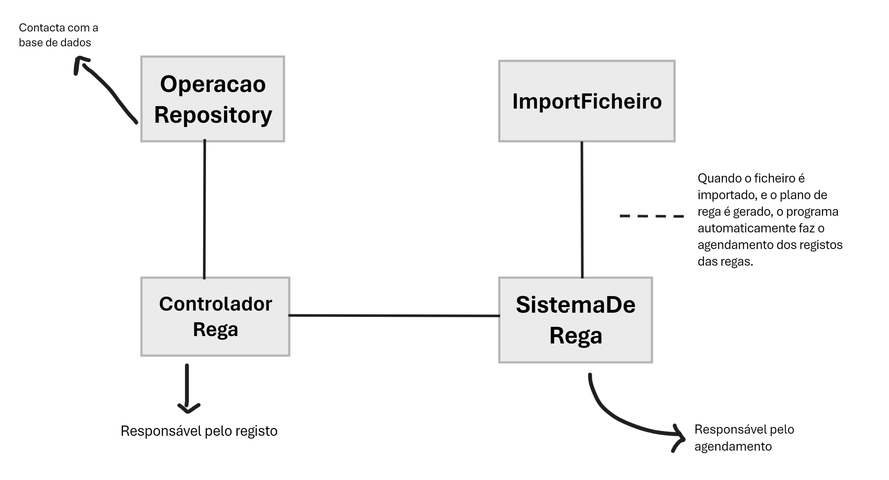

## Planeamento da US-LP03

Como Product Owner, pretendo que seja desenvolvida uma funcionalidade que permita de forma automática consuma o plano de rega gerado pelo
simulador do controlador desenvolvido na USLP02 e que de forma escalonada após
a conclusão da rega em cada sector registe essa operação no caderno de campo.

### 1.1. Análise
    
Nesta user story é necessário fazer uma funcionalidade que irá, através do ficheiro .csv gerado na US-LP02, registar regas no Caderno de Campo. 

### 1.2. Clarificações

**Feitas pelo cliente:** 

> **Questão:** Quando o enunciado se refere a "e que de forma escalonada após a conclusão da rega em cada sector registe essa operação"  ,  significa que a operação apenas tem que ser registada comparando a data e hora atual do computador com a do ficheiro que o plano de rega gerou?
> 
> **Resposta:** Significa que quando termina a rega de uma sector (de acordo com o Plano de Rega criado no LP2) deve ser criada uma entrada no Caderno de Campo da instalação agrícola. A hora actual pode naturalmente ser fornecida pelo computador.

> **Questão:** Qual deve ser o formato do caderno de campo? Também é um ficheiro .csv?
>
> **Resposta:** O formato do Caderno de Campo é definido pela equipa e deve estar modelado/capturado pelo modelo conceptual e pelo lógico, os dados deste caderno são guardados na Base de Dados.

> **Questão:** O conceito de Sistemas Distribuidos, no contexto desta US, assumimos que é especificamente referente à convergência do registo da operação no caderno de campo nos processos. Está correta a assunção?
>
> **Resposta:** Existe uma gralha na escrita do texto, deveria ser:
"No desenvolvimento desta US serao intencionalmente ignorados aspectos estudados em Sistemas Distribuidos (como por exemplo tolerancia a falhas)."
Isto significa que o simulador que está a ser desenvolvido, por exemplo, assume que os sistemas que lhe fornecem dados vão funcionar adequadamente, sem falhas. O que obviamente é uma simplificação do caso real mas pedagógicamente adequada ao ano curricular em que decorre LAPR3.

> **Questão:** Como é que, a partir do ficheiro gerado na US-LP02, sabemos a quantidade de água utilizada na rega?
> 
> **Resposta:** As regas podem ser registadas em minutos e en«m função do tipo de rega instalado no setor e respetivo débito poderiamos calcular a quantidade de água. No entanto, não entendo que o precisem de fazer, os minutos de rega são suficientes.

> **Questão:** No enunciado da USLP03 encontra-se a seguinte instrução: "[...] que de forma escalonada após a conclusão da rega em cada sector registe essa operacão no caderno de campo." Como deve ser feita a implementação deste requisito de escalonamento? Devemos recorrer a threads?
> 
> **Resposta:**

### 1.3. Design

> O grupo idealizou várias maneiras de implementação da user story, no entanto devido à falta de informação ainda não chegamos a uma conclusão definitiva.

Criação das classes:
* RegistoRega
* RegistoRegaUI
* RegistoRegaController

Classes utilizadas já existentes:
* ImportarFicheiro
* ExcecaoFicheiro

#### Descrição

Para esta user story iremos utilizar a classe RegistoRega que irá conter os dados necessários para o 'insert' na base de dados. 
Inicialmente, importamos o ficheiro disponibilizado pelo user, e avaliamos qual a data das regas deste. No caso desta ser posterior ao dia de atual o ficheiro nao irá ser importado.
No entanto, se a data coincidir com a atual ou anterior o sistema aceita o ficheiro e passamos para a importação de dados.

Com isto, teremos que fazer uma 'validação' das horas, no caso em que o dia é o atual, uma vez que podem haver regas que 
ainda estão por acontecer.Se isto acontecer iremos criar uma schedule task que irá inserir a rega na base de dados apenas quando esta for executada.

Adicionalmente, teremos um método (possivel classe) que irá tratar de fazer a inserção da rega na base de dados. Esta ainda é uma função a explorar e, por isso, ainda não está bem planeada.

##### Mini gráfico esclarecedor

### Recursos

[Informação acerca Schedule Task](http://www.java2s.com/example/java-book/task-scheduling.html)