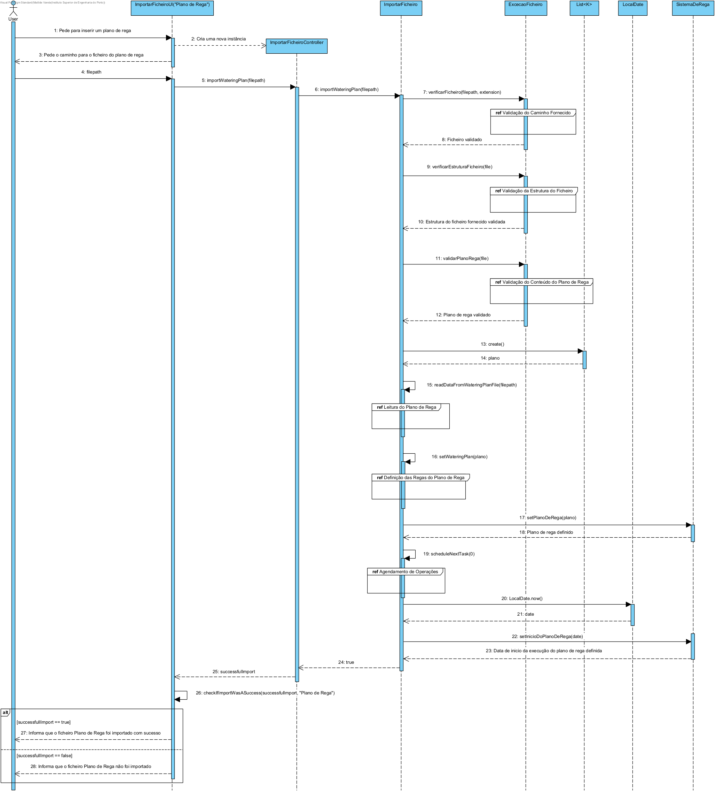
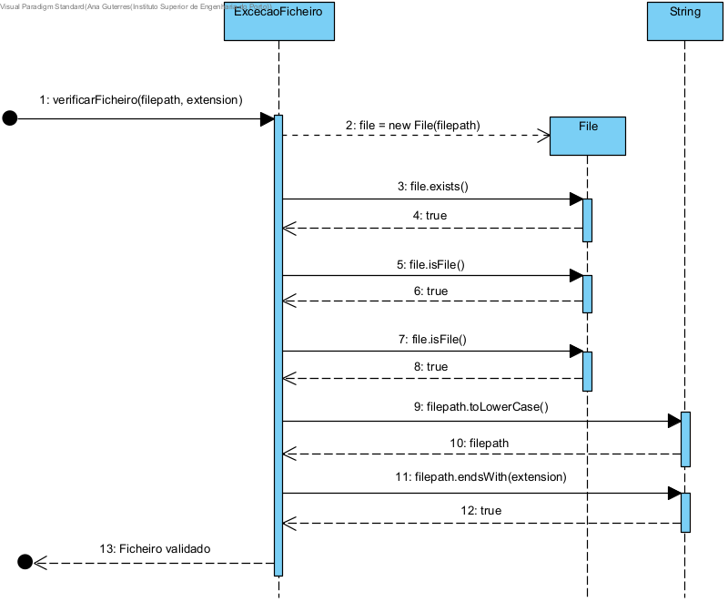
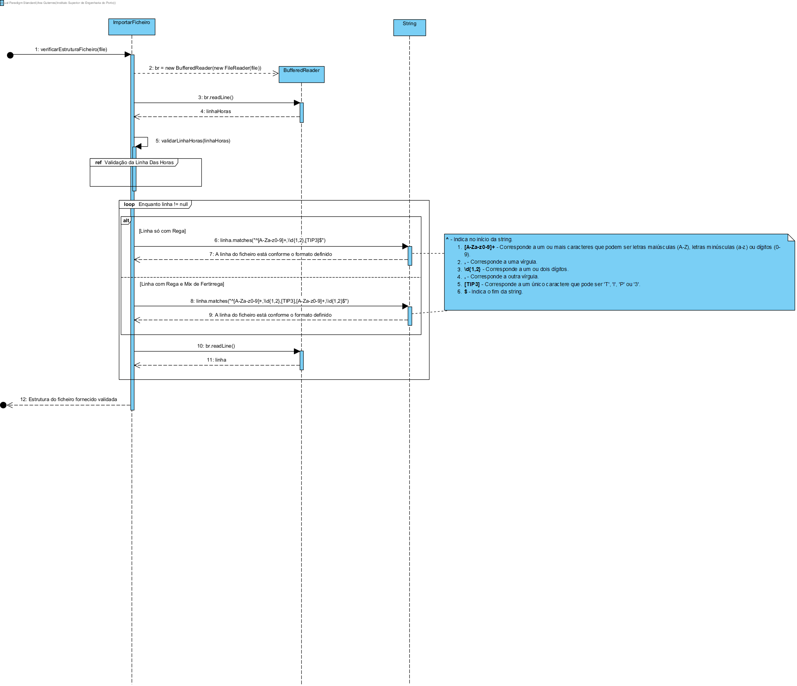
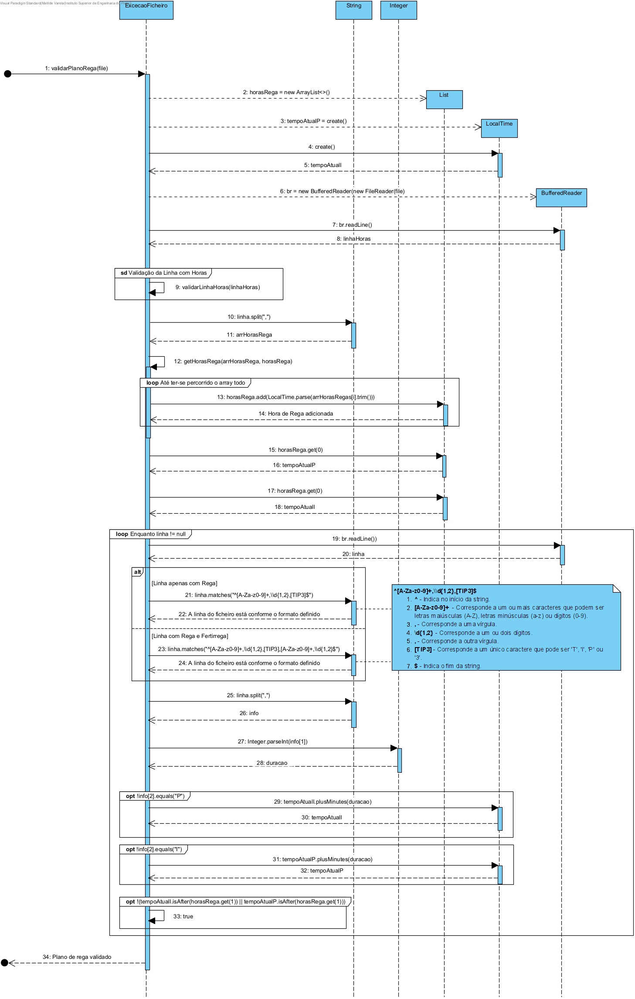
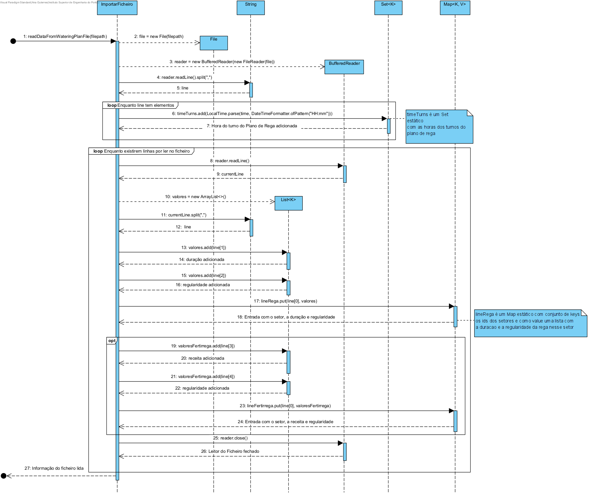
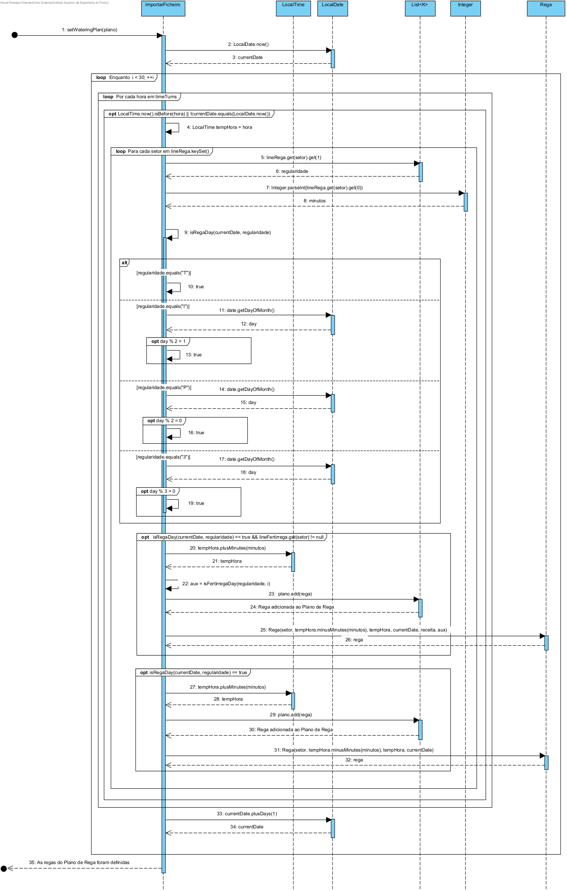
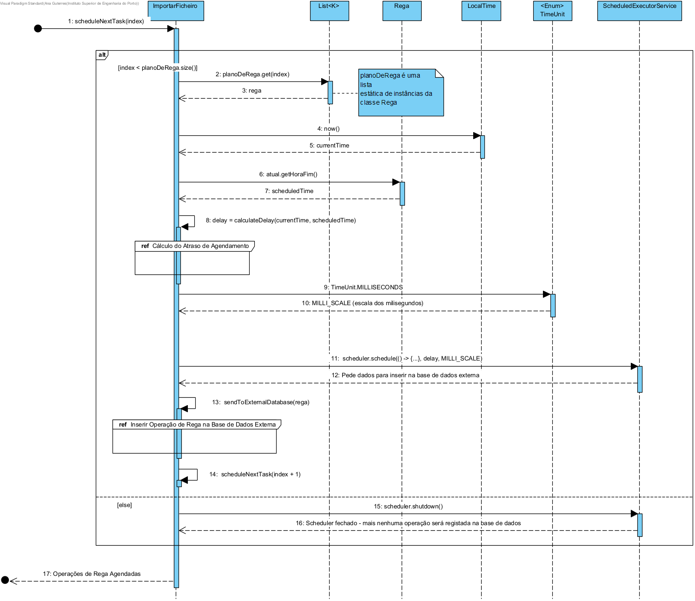

## Planeamento da US-LP10

Como Product Owner, pretendo que seja melhorada a funcionalidade que consiste em simular um controlador do sistema de rega 
previamente desenvolvida na USLP02. A melhoria consiste modelar aspetos relacionados com a fertirrega.


### 1.1. Análise

Deve ser consumido um ficheiro de texto com um conjunto de instruções e gerado um plano de rega para 30 dias. O ficheiro de texto 
deverá ter a seguinte informação e formato:

`<Horas de rega>`

Nesta linha são definidos as horas que se inicia um ciclo de rega, por exemplo:
`8:30 e 17:00`, significa que existem dois ciclos de rega diários que se iniciam respectivamente às 8:30 e 17:00.

`<Sector, Duração, Regularidade,[Mix,Recorrencia]>`

Existe uma linha para cada sector a regar. 
* Sector (uma ou mais parcelas) identifica a zona a ser regada; 
* Duração, o tempo em minutos que o sector deve receber rega;
* Regularidade, a fórmula de recorrência que define os dias que o sector deve ser regado T, todos; I, ímpares, P, pares, 3, a cada 3 dias. 

Opcionalmente a linha pode contar informação sobre a fertirrega a realizar, definida por um mix (composição de fatores de produção,
e a fórmula de recorrência da sua aplicação,por exemplo 7, significa que será aplicada nos
ordinais 1, 8, 15,... (primeiro, oitavo e décimo quinto) do plano de fertirrega.

Exemplo:
```
8:30, 17:00
A,14,T,mix1,5
B,8,T,
C,25,P,mix2,7
D,25,I
E,7,T,mix1,3
F,10,3
```

Note-se que por questões capacidade, os setores são regados de forma sequencial.
A necessidade de regar em dias pares ou ímpares resulta da necessidade de balancear as necessidades de rega de todos setores em função da capacidade máxima
do sistema.
O controlador de rega, contem um plano de rega para 30 dias a partir da data
de criação e em qualquer momento (data/hora) sabe responder se está a regar ou
não, e em caso afirmativo qual o setor que está a regar e quantos minutos faltam
para terminar.

### 1.2. Clarificações

**Feitas pelo cliente:** 

> **Questão:** Suponha a seguinte linha de instrução "A,10,I,Mix1,2", esta instrução afirma que a fertirrega será aplicada no segundo dia do plano, quarto dia do plano, etc, mas também diz inicialmente que apenas se aplica para dias ímpares. O que deverá acontecer caso os dias que respeitam a fórmula de recorrência não sejam dias Ímpares? Por exemplo, caso o plano de rega for criado exatamente dia 1, os ordinais para a fórmula de recorrência "2" vão ser sempre pares o que tornaria a instrução incoerente caso esta apresente inicialmente a indicação de apenas acontecer nos dias ímpares.
> 
> **Resposta:** A questão é interessante e deteção completa de conflitos entre as especificações poderia ser complexa; no contexto do presente é suficiente apresentarem conflito que surjam num planeamento gerado.

> **Questão:** "A,14,T,mix1,5". Isto significa que a rega ocorre todos os dias e que a fertirrega ocorre de acordo com o ordinal, neste exemplo dia 5, 10, 15, etc, após o início do plano? Ou neste setor apenas é aplicada a fertirrega? O tempo serve apenas para a rega ou também contabilizamos para a fertirrega?
>
> **Resposta:** Visto que a fertirrega não pode ser realizada sem a respetiva rega, deve ser gerado um erro para que o operador possa corrigir o ficheiro de entrada.

> **Questão:** Gostava de entender ao certo o que são os "ordinais", tratam-se dos dias em que vão ser aplicados os fatores de produção?
>
> **Resposta:** Se o ordinal for 2, a fertirrega será aplicada no segundo dia do plano, no quarto, no sexto e por aí fora.
Ordinal porque não tem a ver com o dia 2 do calendário mas com o segundo dia do plano.

### 1.3. Design

#### DIAGRAMAS
* Sequence Diagram Geral



* Validação do caminho do ficheiro fornecido



* Validação da Estrutura do Ficheiro



* Validação do Conteúdo do Plano de Rega Sequence Diagram



* Leitura do Plano de Rega



* Definição das Regas do Plano de Rega



* Agendamento de Operações




Classes utilizadas já existentes:
* ImportarFicheiro
* ExcecaoFicheiro
* Rega
* ControladorRega
* SistemaDeRega

#### Descrição

 As alterações feitas à funcionalidade da desenvolvida na USLP02 foram:
 * Atualizar a validação do plano de rega para que uma fertirrega não ocorra sem existir a rega. Posto isto, foi acrescentado 
um método que, caso a linha tenha informação sobre a fertirrega, irá avaliar se nos 30 dias do plano existe algum dia onde é suposto efetuar uma 
fertirrega, no entanto não é efetuada uma rega.
 * Atualizar o import de informação do ficheiro, de modo a ter em conta a informação acerca da fertirrega, e, posterior, criação do plano de rega.

### Recursos
Nenhum