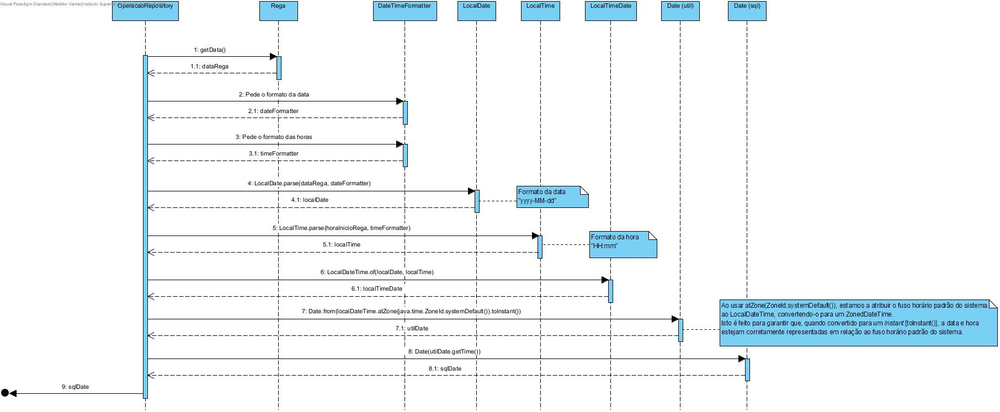

## Planeamento da US-LP11

Como Product Owner, pretendo que seja melhorada a funcionalidade desenvolvida na USLP03 que, de forma automática,
consume o plano de fertirrega gerado pelo simulador do controlador desenvolvido na USLP10 e que de forma escalonada
após a conclusão da rega e/ou fertirrega em cada sector registe essa operação no caderno de campo.

### 1.1. Análise

Nesta user story é necessário fazer uma funcionalidade que irá pedir ao utilizador o caminho para o ficheiro com o Plano
de Rega gerado na USLP10 e que agende as operações de rega/fertirrega, bem como a inserção do seu registo na base de
dados.

Além disso, serão necessárias algumas validações ao nível da área, quantidade a regar e registos já existentes na base
de dados com a mesma informação.

### 1.2. Clarificações

**Feitas pelo cliente:**

> Não houve clarificações feitas pelo cliente relativamente à USLP11.

### 1.3. Design

> NOTA: esta funcionalidade sofreu várias alterações de design. No fim chegou-se ao seguinte plano:

#### Criação das classes:

* Nao houve criação de mais nenhuma classe adicional.

#### Classes utilizadas já existentes:

> A fase do importe do ficheiro é referente à USLP10. Esta funcionalidade está
> ligada ao agendamento e à inserção dos
> registos das operações na base de dados externa.

* ImportarFicheiroUI("Plano de Rega")
* ImportarFicheiroController
* ImportarFicheiro
* ControladorRega
* OperacaoRepository
* Repositories
* DatabaseConnection
* Connection
* CallableStatement
* OracleTypes
* Rega
* ScheduledExecutorService
* LocalTime
* TimeUnit
* Utils
* ExcecaoFicheiro
* LocalDate

#### DIAGRAMAS
* Sequence Diagram Geral (Split)
  

*  Agendamento de Operações
  

* Cálculo do Atraso de Agendamento das Operações
  

* Inserir Operação na Base de Dados Externa
  

* Registo de uma Operação de Fertirrega
  

* Registo de uma Operação de Rega
  

*  Duração da Operação
  

*  Data da Operação
  

#### Descrição

As alterações feitas à funcionalidade da desenvolvida na USLP03 (versão atualizada -> USLP11) foram:

* Verificar se o objeto Rega ao qual se vai registar uma operação na base de dados tem, ou não, valores para os seus
  atributos idMix e Recorrencia. Caso estes atributos sejam ambos NULL então regista-se uma operação de Rega, caso
  contrário, regista-se uma operação de fertirrega.

### Recursos

Nenhum